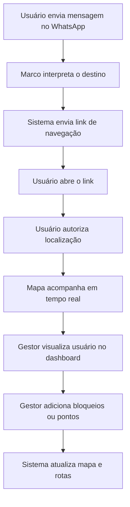

# Connecta Vale

**Navegação operacional em tempo real com WhatsApp, mapa ao vivo e painel de gestão.**

O **Connecta Vale** é um MVP criado para simular uma central de mobilidade operacional.  
Com ele, o usuário pede uma rota pelo WhatsApp, recebe um link de navegação, autoriza a localização e passa a ser acompanhado em tempo real no mapa. O gestor consegue visualizar usuários ativos, adicionar pontos operacionais e criar bloqueios no mapa.

---

## Teste rápido

### 1. Peça uma rota pelo WhatsApp

Envie uma mensagem para:

## **+55 11 5194-5106**

Você pode testar com mensagens como:

> Quero ir para o Pier 4  
> Quero ir para a subestação  
> Me manda a rota para a entrada vale  
> Como chego no ponto de ônibus?  
> Quero ir para o setor de gestão

### Pontos disponíveis para teste

| Ponto | Como pedir pelo WhatsApp |
|---|---|
| Pier 4 | Quero ir para o Pier 4 |
| Subestação | Quero ir para a subestação |
| Entrada Vale | Me manda a rota para a entrada vale |
| Ponto de ônibus | Como chego no ponto de ônibus? |
| Setor de Gestão | Quero ir para o setor de gestão |

Depois de enviar a mensagem, o sistema responderá com um link de navegação.

---

## 2. Abra o link e autorize a localização

Ao abrir o link recebido pelo WhatsApp, clique em **permitir localização**.

Essa etapa é importante porque o sistema precisa da permissão para:

- mostrar sua posição no mapa;
- acompanhar sua movimentação em tempo real;
- permitir que o gestor visualize usuários ativos no dashboard.

O Connecta Vale segue as normas da **LGPD**: a localização só é usada quando o usuário autoriza o compartilhamento.

### Atenção para iPhone

Em alguns iPhones, principalmente usando o **Google Chrome**, o navegador pode bloquear automaticamente a localização.

Se a localização não funcionar corretamente:

- teste pelo **Safari**;
- verifique se o navegador tem permissão de localização ativa;
- abra novamente o link da rota depois de liberar a permissão.

---

## Acesso do gestor

O dashboard administrativo pode ser acessado pelo link:

## https://conecta-vale.vercel.app/gestor

Credenciais de acesso:

| Campo | Valor |
|---|---|
| Email | gestor@conecta-vale.local |
| Senha | Gestor@123 |

---

## O que testar no dashboard

No painel do gestor, é possível:

| Função | O que faz |
|---|---|
| Ver usuários no mapa | Mostra usuários que autorizaram compartilhar localização |
| Acompanhar em tempo real | Atualiza a posição dos usuários no mapa |
| Adicionar bloqueio | Cria um bloqueio operacional em qualquer ponto do mapa |
| Adicionar ponto | Cria um novo ponto operacional ou terminal |
| Remover pontos | Remove pontos criados pelo gestor |
| Simular operação | Permite testar mudanças no mapa e nas rotas |

---

## Como adicionar um bloqueio

No dashboard do gestor:

1. Clique em **Adicionar bloqueio**.
2. Clique em qualquer local do mapa.
3. Na lateral direita, informe:
   - o nome do bloqueio;
   - o tamanho do bloqueio em metros.
4. Clique em **Aplicar** para confirmar.

Para desfazer antes de salvar, clique em **Cancelar**.

Depois de aplicado, o bloqueio passa a ser considerado pelo sistema e pode impactar as rotas dos usuários.

---

## Como adicionar um ponto operacional

No dashboard do gestor:

1. Clique em **Adicionar ponto**.
2. Clique no local desejado no mapa.
3. Na lateral direita, informe:
   - o nome do ponto;
   - o tipo do ponto: **terminal** ou **ponto operacional**.
4. Clique em **Aplicar** para salvar.

Depois de criado, esse ponto passa a aparecer no sistema e pode ser usado como destino.

Exemplo:

> Se o gestor criar um ponto chamado **Sede Administrativa**, o usuário poderá enviar no WhatsApp:  
> **Quero ir para a Sede Administrativa**

O sistema poderá gerar uma rota para esse novo local.

---

## Como remover pontos criados

Na lateral direita do dashboard, o gestor consegue visualizar os pontos criados e remover aqueles que não devem mais permanecer ativos no sistema.

---

## Fluxo principal do MVP

---

## Roteiro recomendado para avaliação

### Teste como usuário

1. Envie no WhatsApp:

> Quero ir para o Pier 4

2. Abra o link recebido.
3. Autorize o uso da localização.
4. Veja a navegação no mapa.

### Teste como gestor

1. Acesse:

> https://conecta-vale.vercel.app/gestor

2. Faça login com:

| Campo | Valor |
|---|---|
| Email | gestor@conecta-vale.local |
| Senha | Gestor@123 |

3. Clique em **Adicionar bloqueio**.
4. Clique em algum ponto do mapa.
5. Informe o nome e o tamanho do bloqueio.
6. Clique em **Aplicar**.
7. Solicite uma nova rota pelo WhatsApp e observe o comportamento do sistema.

---

## Funcionalidades principais

- Solicitação de rotas pelo WhatsApp.
- Interpretação inteligente de destinos.
- Envio automático de link de navegação.
- Mapa interativo.
- Localização em tempo real com autorização do usuário.
- Painel administrativo para gestores.
- Visualização de usuários ativos no mapa.
- Criação de pontos operacionais.
- Simulação de bloqueios.
- Atualização dinâmica da operação.

---

## Objetivo do projeto

O **Connecta Vale** demonstra como uma operação pode usar WhatsApp, mapa em tempo real e painel de gestão para melhorar a mobilidade interna.

A proposta é facilitar o envio de rotas, o acompanhamento de usuários e a adaptação do mapa operacional conforme bloqueios, pontos fixos e necessidades da operação.
